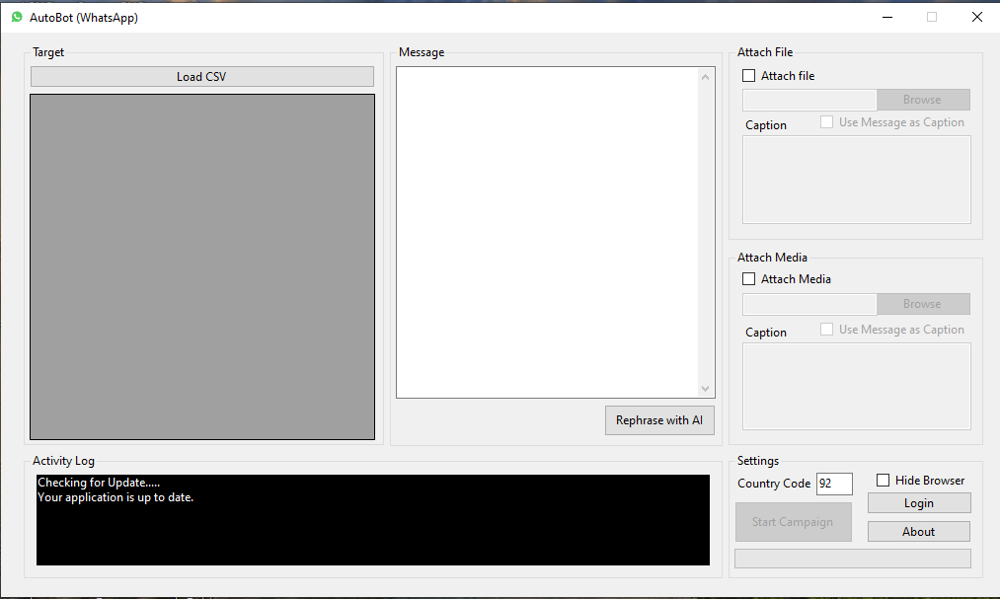

### This Software is configure for Pakistan. To reconfigure it change country code or contact: +92 301 2216201

# WhatsApp Bot - Automated Messaging with AI-Powered Features

This WhatsApp bot is a **100% free** and reliable desktop application designed to automate messaging tasks. 


## Sample File

## Features

- **Customized Message Sending:** 
  - Send personalized messages to a list of contacts imported from a CSV file.
  
- **Media and File Sharing:** 
  - Easily send custom files, images, and media to each contact.
  
- **Session Management:** 
  - Robust session control ensures reliable communication without interruptions.
  
- **AI-Powered Message Rephrasing:** 
  - Leverage the power of AI (via the Gemini API) to automatically rephrase your messages, enhancing communication quality.
  
- **User-Friendly Interface:** 
  - Simple and intuitive design for seamless automation of bulk messaging.

## Installation

1. Clone the repository:
   ```bash
   git clone https://github.com/yourusername/whatsapp-bot.git](https://github.com/hamidsaeed13/Free-WhatsApp-Bot---Automated-Messaging-with-AI-Powered-Features.git
